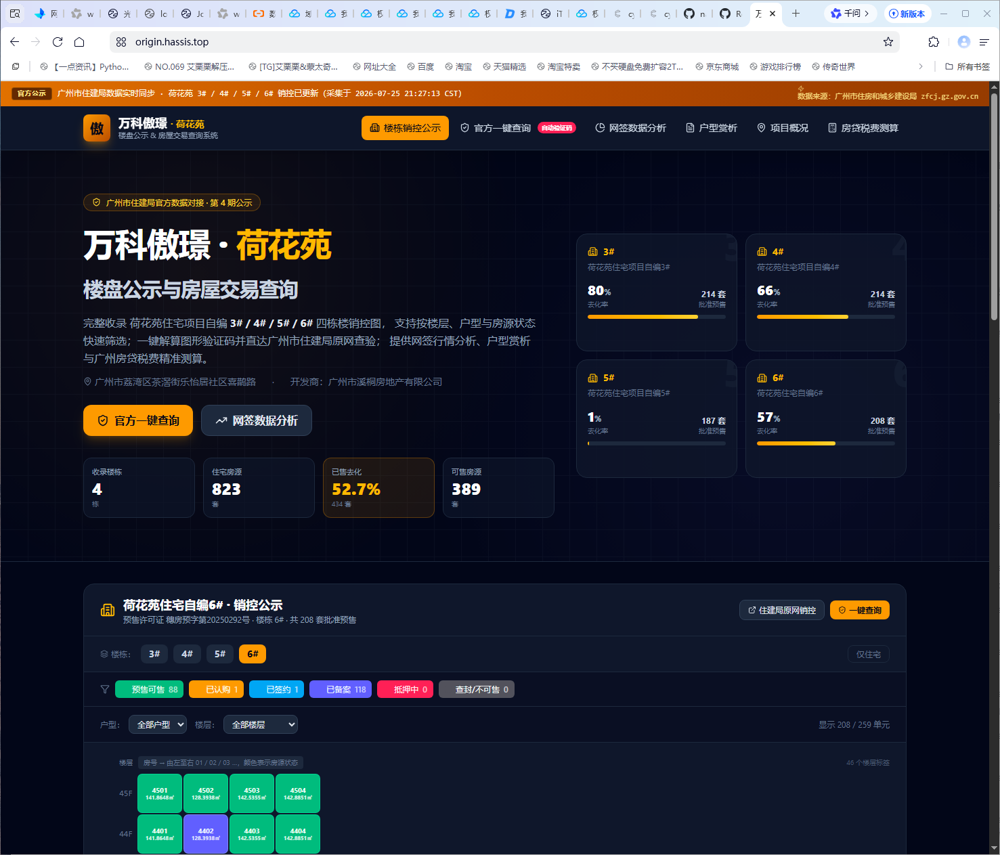

# 万科傲璟 · 荷花苑 — 楼盘公示与房屋交易查询

> 完整收录 荷花苑住宅项目自编 3# / 4# / 5# / 6# 四栋楼销控图的可视化站点，
> 对接广州市住房和城乡建设局（`zfcj.gz.gov.cn`）真实公示数据，提供销控筛选、
> 官方验证码直通、网签行情分析、户型赏析与广州房贷税费测算。

线上地址：<https://origin.hassis.top>



## 功能亮点

- **楼栋销控与房源实时公示**：3# / 4# / 5# / 6# 销控图，按楼层、户型、状态
  （预售可售 / 已认购 / 已签约 / 已备案 / 抵押 / 查封 / 非住宅）筛选，点击房号即查
  建面、套内面积、抵押状态、预售许可与估算一房一价。
- **广州市住建局一键直通**：预填关键字（项目名 荷花苑 / 开发商 溪桐 / 地址 喜鹊），
  图形验证码本地展示与"智能自动识别"演示，生成与 4 栋楼 sProjectId 挂钩的直达链接,
  跳转住建局原网项目详情与销控表页。
- **网签行情与销售分析大屏**：四大楼栋去化率对比、高低楼层价格梯度溢价、
  房源状态分布与网签进度可视化。
- **臻品户型赏析**：85㎡ 精致三房 / 115㎡ 舒适四房 / 129㎡ 尊享楼王 /
  143㎡ 奢阔大平层四档户型，含套内实用率与朝向说明。
- **广州房贷与税费测算器**：支持商业贷款 / 纯公积金 / 组合贷款，
  广州最新首付比例（低至 15%），自动核算契税、住宅专项维修资金及月供还款明细。

## 数据来源

全部销控数据采集自广州市住房和城乡建设局公示接口（采集于 `2026-07-25`）：

- 项目基本信息：`POST /ysqgk/Api/WebApi/fdcxmjbxx.ashx?sProjectId=<id>`
- 楼栋列表：`/ysqgk/Api/WebApi/xmldxx.ashx?sProjectId=<id>&sPreSellNo=<presell>`
- 逐套销控：`/ysqgk/Api/WebApi/xmxkbxx.ashx?sProjectId=<id>&sPreSellNo=<presell>&buildingId=<bid>`

采集与规范化脚本（一次性）保存于 `scripts/fetch_data.py` 的注释里。
最终数据落盘为 `data/sales-control.json`（1027 条房源记录：944 套住宅 + 83 套配套），
通过 `src/data/projectData.ts` 派生为应用的楼盘/单元/户型数据结构。

> 注意：广州住建局未公示逐套成交价格，"估算一房一价"基于楼栋均价 + 楼层修正
> （每高一档约 +350 元/㎡）做示例性推算，非官方成交数据。

## 技术栈

- 前端：React 19 + Vite 6 + TypeScript + Tailwind CSS v4 + lucide-react
- 构建：`npm run build` → 产出 `dist/`
- 纯前端静态站，无后端；所有交互在浏览器侧完成。

## 本地开发

```bash
npm install
npm run dev      # http://localhost:3000
npm run build    # 产出 dist/
npm run lint     # tsc --noEmit 类型检查
```

## 部署架构

```
用户 ──HTTPS──> EdgeOne 边缘（TrustAsia DV 证书）
                │ HTTPS 回源（SNI=origin.hassis.top，源站 LE 证书校验通过）
                ▼
                本机 nginx 443（origin.hassis.top server 块，root=/www/wwwroot/origin.hassis.top）
                │
                └─ 静态文件 dist/* + SPA fallback（try_files → /index.html）
```

- 本机已加 nginx vhost：`/www/server/panel/vhost/nginx/origin.hassis.top.conf`（80 + 443 双端口）
- SSL 证书：Let's Encrypt（acme.sh，`origin.hassis.top_ecc`），续签时自动 reload nginx
- EdgeOne 域名：`origin.hassis.top` CNAME 到 `*.eo.dnse2.com`
- 回源 IP：本机 IPv4 公网（通过 DNS CNAME → EdgeOne → 回源 172.245.195.21）

### 更新线上

```bash
cd /root/vanke-origin
npm run build
rm -rf /www/wwwroot/origin.hassis.top/*
cp -r dist/* /www/wwwroot/origin.hassis.top/
# 修改 HTML 后建议在 EdgeOne 控制台 Purge 一次根路径缓存
```

## 真实数据每日刷新

销控数据自采集后会逐渐过期（住宅网签、备案状态会实时变动）。为保证 `origin.hassis.top`
反映住建局最新公示，本项目落地了「定时缓存 + SQLite + 重新构建」的全自动刷新链路：

```
systemd timer (每日 03:17)
  └─ deploy/refresh.sh  (set -euo pipefail，任一步失败即中止，保留旧线上文件)
      ├─ backend/fetcher.py once   → 拉 4 栋楼全量销控 → 写 backend/sales.db (SQLite)
      │                            → 原子 os.replace 覆盘 data/sales-control.json
      ├─ npm run build             → 重新构建 dist/（JSON 在构建期打进 bundle）
      └─ cp -r dist/* /www/wwwroot/origin.hassis.top/   → 部署到 nginx root
```

### 数据采集（backend/fetcher.py）

只用 Python 标准库（`urllib.request` + `sqlite3`），**无需 pip 安装任何包**。
四个住建局公开 API 无需验证码：

- 项目基本信息：`fdcxmjbxx.ashx?sProjectId=<id>`（项目名 / preSellNo / 开发商 / 销控汇总）
- 楼栋列表：`xmldxx.ashx?sProjectId=<id>&sPreSellNo=<presell>`（取 buildingId）
- 逐套销控：`xmxkbxx.ashx?sProjectId=<id>&sPreSellNo=<presell>&buildingId=<bid>`（按楼层 group）

四个楼栋的 `sProjectId` 硬编码在 `BUILDINGS` 常量里，与前端 `OFFICIAL_BASIC` 一一对应。
抓取时每栋间隔 1s 礼貌等待，全量 1027 套约 20–30s。

状态映射与官方 `totalSaleNum` 已对齐：
`pactStatus` 1=可售/预售可售 | 2=已认购 | 3=已签约 | 5=已备案；
`pledgeStatus` 2=已抵押 | 0=无；`closed=1` 查封；`preSellStatus` 0=非预售配套。
「已售 = registered + contracted + subscribed」。非住宅单元 `status="non-residential"`、
`statusKey="other"`，与前端 `STATUS_META` 索引一致。

用法：

```bash
cd /root/vanke-origin
/usr/bin/python3 backend/fetcher.py once    # 拉取 + 写 SQLite + 覆盘 JSON
/usr/bin/python3 backend/fetcher.py dump    # 仅从 SQLite 重新导出 JSON（不重新拉取）
```

> ⚠️ ExecStart / 脚本里必须用绝对路径 `/usr/bin/python3`，不能写裸 `python3`：
> 本机 root 交互 PATH 里 `python3` 命中 node venv，裸调用会跑错解释器。

### 容灾与回滚

- **fetcher 失败不动旧数据**：`fetch_once()` 失败时不覆盖 SQLite，`dump_json()` 用
  临时文件 + `os.replace` 原子替换 `data/sales-control.json`，任何中途异常都保留旧 JSON。
- **refresh.sh 任一步失败即中止**：`set -euo pipefail` 保证 fetcher 失败时不会用旧 JSON
  重新构建（虽然理论上旧 JSON 也能构建），更不会在 build 失败时覆盖 nginx root。
  站点持续使用上一次成功的数据，日志记录失败原因。
- **日志**：systemd 的 `StandardOutput/Error=append:` 写入 `backend/fetcher.log`，
  可 `tail -f backend/fetcher.log` 跟踪。`fetch_log` 表也记录每次抓取的成败/套数。

### systemd 部署

repo 内 `deploy/` 自带三件套，生效副本需 cp 到 `/etc/systemd/system/`：

```bash
cp deploy/vanke-origin-fetcher.{service,timer} /etc/systemd/system/
systemctl daemon-reload
systemctl enable --now vanke-origin-fetcher.timer
systemctl list-timers vanke-origin-fetcher.timer          # 确认 NEXT 指向次日 03:17±10m
systemctl start vanke-origin-fetcher.service              # 手动触发一次看日志
tail -30 backend/fetcher.log
```

timer 配置：`OnCalendar=*-*-* 03:17`、`Persistent=true`（错过的定时点开机补跑）、
`RandomizedDelaySec=10m`（错峰，避免与系统其它 daily 任务挤同一秒）。

### git 与生成产物

- `data/sales-control.json` **进 git**（前端构建期直接读它，作为 seed 数据）；
  每日刷新会让工作区 dirty，择期手动 commit 留痕，**timer 不自动 commit**。
- `backend/sales.db`、`backend/fetcher.log` **不进 git**（已由 `.gitignore` 忽略：

  `backend/*.db`、`*.log`），是运行时产物，每台机器各自生成。

> ⚠️ EdgeOne 缓存：HTML 资源带 `Cache-Control: no-cache, must-revalidate`，
> `/assets/*.{js,css}` 带 immutable 长缓存（文件名含 hash，安全）。
> 首次部署后 `https://origin.hassis.top/` 若命中 EdgeOne 缓存的旧 404 条目，
> 任意带 query 的访问（如 `/?v=1`）会强制 MISS 取新内容；根路径彻底刷新需用户在
> EdgeOne 控制台点 **刷新缓存 / Purge**。

> ⚠️ 部署时附带修复了一个宝塔遗留问题：`extension/time.hassis.top/proxy.conf` 与主 conf
> 各含一个 `location / {}` 块导致 `nginx -t` duplicate 报错（多年未能 reload 成功）。
> 已把 `proxy.conf` 中冗余的 `location / {}` 注释（保留 `/static/`），备份于 `proxy.conf.bak.*`。
> time.hassis.top 现公网回源走新机，本机此 conf 实为热备，注释不影响线上。

## 免责声明

本站为公示辅助工具，数据来自官方渠道但存在更新延迟。所有房源状态、价格、预售信息
以广州市住建局网签系统实时数据为最终依据。非万科官方产品，与开发商无隶属关系。

## 致谢

项目结构与组件划分参考自 [jeffreyrobeson/vanke-origin](https://github.com/jeffreyrobeson/vanke-origin)
（Google AI Studio 生成的同名演示项目），其源数据为占位假数据；本项目把全部数据替换为
从广州市住建局真实采集的销控与楼盘基本信息，并按真实楼层/套数/状态结构重写。
